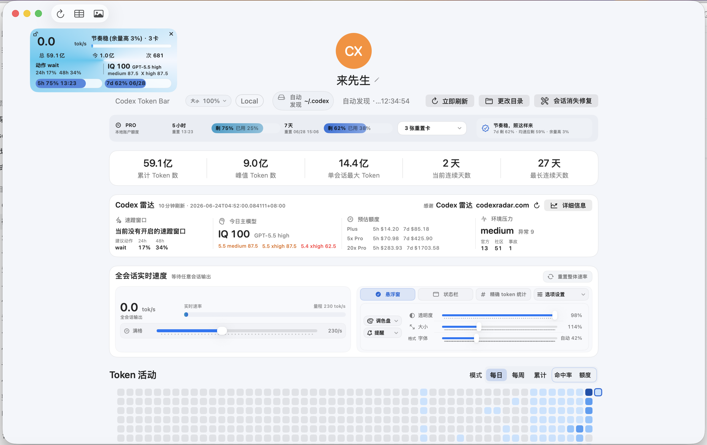
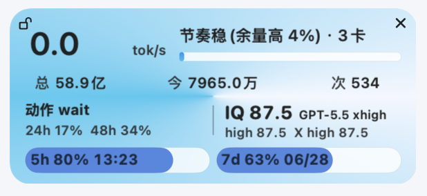
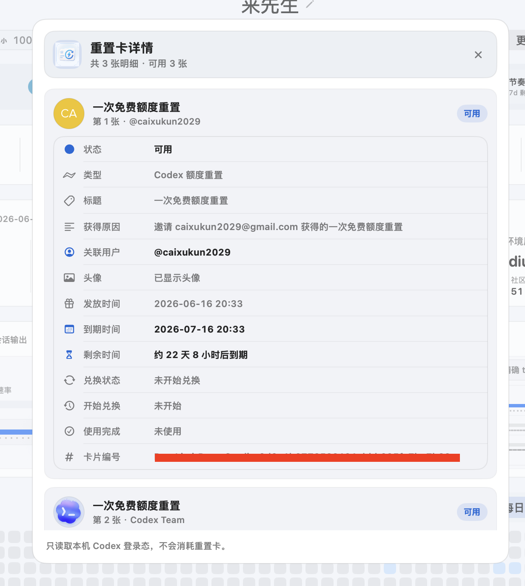
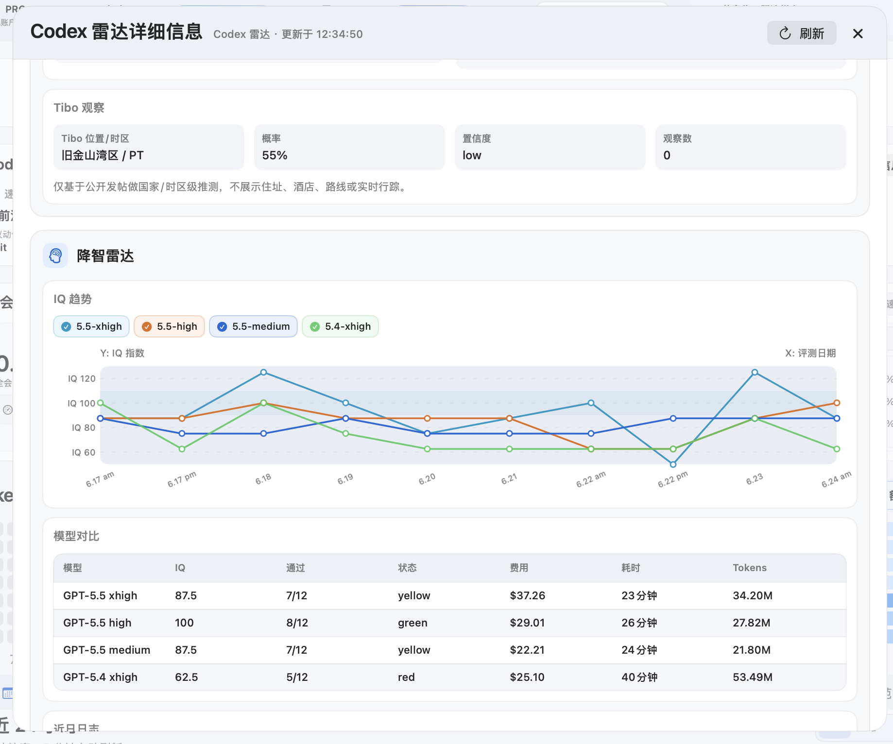
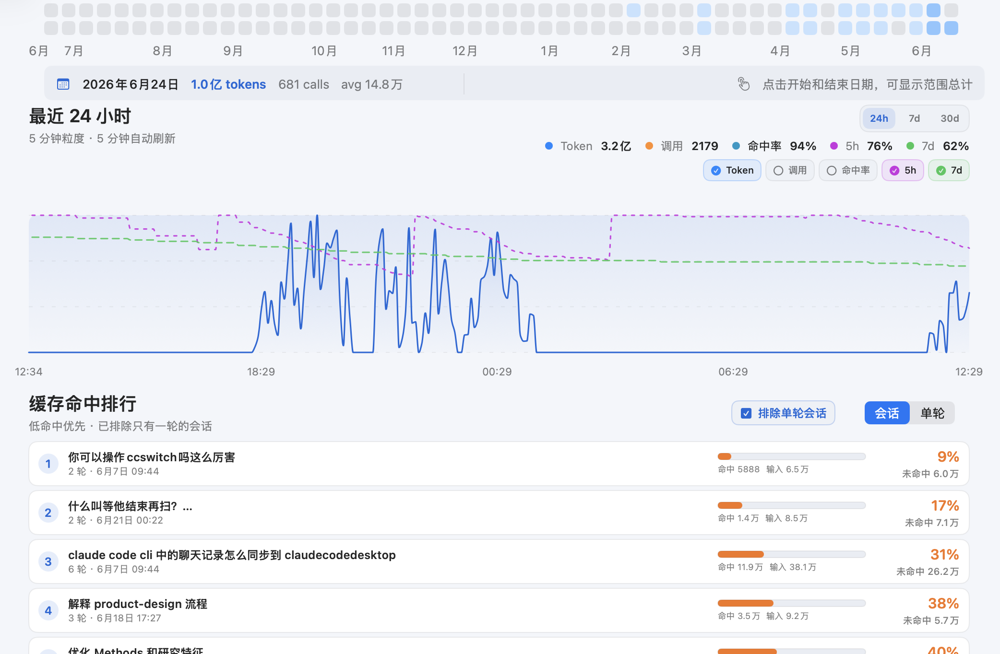

# Codex Token Bar

简体中文 | [English](#english)

<table align="center">
  <tr>
    <td align="center" width="180">
      <br>
      <strong>Codex Token Bar</strong>
    </td>
    <td align="center" width="280">
      <br>
      欢迎扫码加入群聊，讨论使用问题、交流想法，也会发布产品发布和更新通知。
    </td>
  </tr>
</table>

Codex Token Bar 是一个本地优先的 Codex 用量仪表盘。它读取本机 Codex 日志、账号接口和 Codex 雷达站，显示 token 用量、实时输出速度、缓存命中率、5h / 7d 额度、推荐模型、IQ 趋势和重置卡详情。

当前有两条正式实现线：

- macOS：Swift / SwiftUI 原生版，继续作为 macOS 主版本发布。
- Windows：Tauri + React / TypeScript + Rust 版，分别提供 x64 和 ARM64 安装包。

<p align="center">
  
</p>

<p align="center">
  
</p>

<p align="center">
  
  
  
</p>

## 亮点

- 全会话实时 token 速率，支持主界面、悬浮窗和状态栏/托盘读数。
- 接入 Codex 雷达站：显示建议动作、24h / 48h 概率、今日主模型、IQ 分数、模型对比和环境压力。
- 速蹬窗口：把雷达建议、模型 IQ、5h / 7d 额度和本地实时速度放进一个可配置的小窗口。
- 年度 token 热力图、最近 24 小时 5 分钟粒度曲线、缓存命中率曲线和缓存排行。
- Codex 5h / 7d 额度显示、本地轻量历史记录、雷达站额度预估和节奏提示。
- 重置卡详情：显示可用重置机会、每张卡的来源、关联用户、到期时间、剩余时间和卡片编号。
- 本地优先：读取 `~/.codex` 本地数据，不上传 prompt、输出、日志或账号额度。

## 平台版本

| 平台 | 实现 | 发布资产 | 说明 |
|---|---|---|---|
| macOS Apple Silicon | Swift / SwiftUI | `CodexTokenBar-v0.7.0-macos-arm64.dmg` | 当前 macOS 稳定线，带 Sparkle 更新检查。 |
| Windows x64 | Tauri + React + Rust | `CodexTokenBar-v0.7.1-windows-x64-setup.exe` | 面向 Intel / AMD Windows 10/11，带 Tauri 自动更新。 |
| Windows ARM64 | Tauri + React + Rust | `CodexTokenBar-v0.7.1-windows-arm64-setup.exe` | 面向 Windows on ARM，带 Tauri 自动更新；安装器进程可能经模拟运行，但 App 二进制是 ARM64。 |

## 为什么

Codex 的本地日志里已经有很多有用信息，但平时很难快速看清“今天用了多少”“现在输出多快”“缓存是不是命中”“额度够不够烧”。Codex Token Bar 把这些本地数据整理成一个轻量 dashboard，并提供一个不挡视线的小悬浮窗。

## 特色：Codex 雷达站

Codex Token Bar 可以读取 [codexradar.com](https://codexradar.com/) 提供的 JSON 订阅，把雷达站信息整理进主界面和悬浮窗。你可以直接看到当前建议动作、24h / 48h 概率、今日主模型、IQ 分数、其他模型对比、Plus / 5x Pro / 20x Pro 的 5h 与 7d 预估额度，以及带曲线和表格的详细信息。

默认每 10 分钟刷新一次。雷达数据来自公开订阅，主界面会标明 `Codex 雷达 codexradar.com` 作为来源。

## 特色：重置卡详情

Codex Token Bar 会读取 Codex 自己使用的本地账号接口，把“重置机会 / 重置卡”展示成可读详情。你可以看到当前有几张可用重置卡、每张卡为什么发放、关联到谁、明确的到期日期、还剩多久到期和卡片编号。

这个功能是只读的：应用只展示信息，不会调用消耗重置卡的接口，也不会上传账号额度或会话内容。

## 安装

推荐从 [GitHub Releases](https://github.com/hututuo/codex-token-bar/releases/latest) 下载对应平台的安装包。

### macOS

1. 下载 `CodexTokenBar-v0.7.0-macos-arm64.dmg` 和 `SHA256SUMS-v0.7.0.txt`。
2. 可选校验：

```bash
shasum -a 256 CodexTokenBar-v0.7.0-macos-arm64.dmg
cat SHA256SUMS-v0.7.0.txt
```

3. 打开 DMG，把 `Codex Token Bar.app` 拖到 Applications。

macOS 构建是 ad-hoc 签名，尚未 Apple notarize。首次打开如果提示“未知开发者”：系统设置 -> 隐私与安全 -> 找到 `Codex Token Bar` -> 点“仍要打开” -> 确认“打开”。

备用一行安装方式：

```bash
curl -fsSL https://raw.githubusercontent.com/hututuo/codex-token-bar/main/install.sh | bash
```

### Windows

1. Windows x64 下载 `CodexTokenBar-v0.7.1-windows-x64-setup.exe`。
2. Windows ARM64 下载 `CodexTokenBar-v0.7.1-windows-arm64-setup.exe`。
3. 可选校验：

```powershell
Get-FileHash .\CodexTokenBar-v0.7.1-windows-x64-setup.exe -Algorithm SHA256
Get-Content .\SHA256SUMS-v0.7.1-windows.txt
```

Windows 构建暂未使用商业代码签名证书。首次下载运行时，Microsoft Defender SmartScreen 可能提示未知发布者；请只从本仓库官方 Release 下载，并在运行前核对 SHA256。

Windows 10/11 通常已经内置或自动安装 WebView2 Runtime；如果系统缺失，安装器会按 Tauri 默认策略处理 WebView2。

## 更新

macOS Swift 版内置 Sparkle 更新检查。首次引导或菜单栏可以开启“自动检查更新”；开启后，App 会定期读取 GitHub 上的 `appcast.xml`，发现更高版本后弹窗提示，由你确认后再安装，不会静默替换应用。

Windows Tauri 版从 v0.7.1 开始接入内置更新检查。主界面可点击“检查更新”，App 会读取 GitHub Release 里的 `latest-windows.json`，验证 Tauri updater 签名后再进入安装流程。Windows 更新 metadata 与 macOS Sparkle appcast 分开维护，不会混用。

## 可选：Codex Desktop 侧边栏补丁

部分 Codex Desktop 版本会只从全局最近会话第一页生成项目侧边栏。如果某个 workspace 的很多本地会话不在第一页里，侧边栏就可能只显示几条对话，但本地数据库其实还在。

Codex Token Bar 附带一个可选的本机热补丁脚本：

```bash
curl -fsSL https://raw.githubusercontent.com/hututuo/codex-token-bar/main/scripts/patch_codex_desktop_sidebar.sh | bash -s -- install
```

查看状态：

```bash
curl -fsSL https://raw.githubusercontent.com/hututuo/codex-token-bar/main/scripts/patch_codex_desktop_sidebar.sh | bash -s -- status
```

回滚到最近一次备份：

```bash
curl -fsSL https://raw.githubusercontent.com/hututuo/codex-token-bar/main/scripts/patch_codex_desktop_sidebar.sh | bash -s -- rollback
```

脚本会按 bundle identifier 自动发现已安装的 Codex Desktop App，也可通过 `CODEX_APP_PATH` 或 `--app PATH` 显式指定。随后它会备份 `app.asar` 和原始签名，本地改写 renderer bundle，重新 ad-hoc 签名并打开该 App。它不会修改 `~/.codex` 数据。后续官方 Codex 更新可能会覆盖这个补丁。

## 数据源

应用会把包含以下内容的目录视为 Codex Home：

```text
sessions/
state_5.sqlite
```

`sessions/` 用于精确 token_count、缓存命中率和会话轮次统计。`state_5.sqlite` 在可用时用于补充会话元数据。账号额度通过本地 Codex 账户接口读取，并只把轻量额度百分比历史写入应用自己的本地数据目录。

## 从源码运行

macOS Swift 版：

```bash
brew install git-lfs
git lfs install
scripts/prepare_tiktoken_lfs.sh
swift run CodexTokenBar
```

Windows / Tauri 版：

```powershell
cd tauri-app
npm ci
npm run tauri -- dev
```

## 本地打包

macOS Swift 发布包：

```bash
SPARKLE_PRIVATE_KEY_FILE="$HOME/.config/codex-token-bar/sparkle-ed25519-private.key" \
  scripts/build_release.sh v0.7.0
```

Windows Tauri 发布包：

```powershell
.\scripts\build_tauri_windows_release.ps1 -Version 0.7.1 -Arch both
```

发布脚本会分别生成 Windows x64 / ARM64 NSIS 安装器、对应 `.sig` 更新签名、`latest-windows.json` 和 `SHA256SUMS-v0.7.1-windows.txt`。Windows 安装器当前未使用商业代码签名证书；`.sig` 只用于 Tauri 自动更新校验。

## License

MIT

---

## English

Codex Token Bar is a local-first Codex usage dashboard. It reads local Codex logs, account endpoints, and the Codex Radar feed to show token usage, live output speed, cache hit rates, 5h / 7d quota, recommended models, IQ trends, and reset-credit details.

There are now two official implementation lines:

- macOS: native Swift / SwiftUI, used for the macOS release.
- Windows: Tauri + React / TypeScript + Rust, distributed as separate x64 and ARM64 installers.

<p align="center">
  
</p>

<p align="center">
  
</p>

<p align="center">
  
  
  
</p>

## Highlights

- Live all-session token speed across the dashboard, floating panel, and status/tray surfaces.
- Codex Radar integration: suggested action, 24h / 48h probabilities, today's primary model, IQ score, model comparison, and environment pressure.
- Floating pace panel: combines Radar action, model IQ, 5h / 7d quota, and local live speed in a configurable compact window.
- Yearly token heatmap, 5-minute recent activity chart, cache hit-rate curve, and cache hit ranking.
- Codex 5h / 7d quota display with lightweight local history, Radar quota estimates, and compact pace hints.
- Reset credit details: see available reset credits, grant reason, linked user, expiry time, remaining time, and card ID.
- Local-first: reads local `~/.codex` data and does not upload prompts, outputs, logs, or quota data.

## Platform Builds

| Platform | Implementation | Release asset | Notes |
|---|---|---|---|
| macOS Apple Silicon | Swift / SwiftUI | `CodexTokenBar-v0.7.0-macos-arm64.dmg` | Current stable macOS line with Sparkle update checking. |
| Windows x64 | Tauri + React + Rust | `CodexTokenBar-v0.7.1-windows-x64-setup.exe` | For Intel / AMD Windows 10/11, with Tauri auto-update. |
| Windows ARM64 | Tauri + React + Rust | `CodexTokenBar-v0.7.1-windows-arm64-setup.exe` | For Windows on ARM, with Tauri auto-update. The installer process may run under emulation, while the app binary is ARM64. |

## Why

Codex already writes useful local usage data, but it is hard to see the current speed, daily burn, cache behavior, and quota pace at a glance. Codex Token Bar turns those local files into a small dashboard and an unobtrusive floating meter.

## Feature: Codex Radar

Codex Token Bar can read the public JSON feed from [codexradar.com](https://codexradar.com/) and bring Radar data into the dashboard and floating panel. You can see the current suggested action, 24h / 48h probabilities, today's primary model, IQ scores, other model comparisons, Plus / 5x Pro / 20x Pro 5h and 7d quota estimates, plus detailed charts and tables.

The Radar feed refreshes every 10 minutes by default. The dashboard credits the source as `Codex 雷达 codexradar.com`.

## Feature: Reset Credit Details

Codex Token Bar reads the same local account endpoint used by Codex and turns reset credits into a readable detail view. You can see how many reset credits are available, why each one was granted, who it is linked to, the exact expiry date, remaining time, and card ID.

This feature is read-only: the app displays the information but never calls the endpoint that consumes a reset credit, and it does not upload quota data or conversation content.

## Installation

Download the correct installer from [GitHub Releases](https://github.com/hututuo/codex-token-bar/releases/latest).

### macOS

1. Download `CodexTokenBar-v0.7.0-macos-arm64.dmg` and `SHA256SUMS-v0.7.0.txt`.
2. Optionally verify:

```bash
shasum -a 256 CodexTokenBar-v0.7.0-macos-arm64.dmg
cat SHA256SUMS-v0.7.0.txt
```

3. Open the DMG and drag `Codex Token Bar.app` to Applications.

The macOS build is ad-hoc signed and is not Apple notarized. macOS may show an "unidentified developer" warning on first launch. Download only from the official release page and verify the SHA256 checksum before opening.

Backup install:

```bash
curl -fsSL https://raw.githubusercontent.com/hututuo/codex-token-bar/main/install.sh | bash
```

### Windows

1. Download `CodexTokenBar-v0.7.1-windows-x64-setup.exe` for Windows x64.
2. Download `CodexTokenBar-v0.7.1-windows-arm64-setup.exe` for Windows ARM64.
3. Optionally verify:

```powershell
Get-FileHash .\CodexTokenBar-v0.7.1-windows-x64-setup.exe -Algorithm SHA256
Get-Content .\SHA256SUMS-v0.7.1-windows.txt
```

The Windows build is currently unsigned with a commercial code-signing certificate. Microsoft Defender SmartScreen may warn about an unknown publisher on first launch. Download only from the official release page and verify the SHA256 checksum before running.

Windows 10/11 usually includes or automatically installs WebView2 Runtime. If it is missing, the installer follows Tauri's default WebView2 handling.

## Update

The macOS Swift build includes Sparkle update checking. You can enable automatic update checks from the first-run guide or the macOS app menu. When enabled, the app periodically reads the GitHub `appcast.xml`; if a newer version is available, it asks you before installing.

The Windows Tauri build uses built-in update checking starting from v0.7.1. Click "Check for Updates" in the dashboard; the app reads `latest-windows.json` from GitHub Releases, verifies the Tauri updater signature, and then starts the installer flow. Windows update metadata is separate from the macOS Sparkle appcast.

## Optional Codex Desktop Sidebar Patch

Some Codex Desktop builds populate a project sidebar from only the first global recent-conversation page. Codex Token Bar includes an optional local hot patch:

```bash
curl -fsSL https://raw.githubusercontent.com/hututuo/codex-token-bar/main/scripts/patch_codex_desktop_sidebar.sh | bash -s -- install
```

Status:

```bash
curl -fsSL https://raw.githubusercontent.com/hututuo/codex-token-bar/main/scripts/patch_codex_desktop_sidebar.sh | bash -s -- status
```

Rollback:

```bash
curl -fsSL https://raw.githubusercontent.com/hututuo/codex-token-bar/main/scripts/patch_codex_desktop_sidebar.sh | bash -s -- rollback
```

The script auto-discovers the installed Codex Desktop app by bundle identifier, or accepts an explicit path through `CODEX_APP_PATH` or `--app PATH`. It then backs up `app.asar` and the original signature, rewrites the renderer bundle locally, ad-hoc re-signs the selected app, and reopens it. It does not modify `~/.codex` data.

## Data Sources

The app treats a folder with the following entries as Codex Home:

```text
sessions/
state_5.sqlite
```

`sessions/` powers precise token_count, cache hit-rate, and turn-level statistics. `state_5.sqlite` supplements session metadata. Account quota history stores only lightweight percentage samples in the app's local data directory.

## Run From Source

macOS Swift build:

```bash
brew install git-lfs
git lfs install
scripts/prepare_tiktoken_lfs.sh
swift run CodexTokenBar
```

Windows / Tauri build:

```powershell
cd tauri-app
npm ci
npm run tauri -- dev
```

## Package Locally

macOS Swift release assets:

```bash
SPARKLE_PRIVATE_KEY_FILE="$HOME/.config/codex-token-bar/sparkle-ed25519-private.key" \
  scripts/build_release.sh v0.7.0
```

Windows Tauri release assets:

```powershell
.\scripts\build_tauri_windows_release.ps1 -Version 0.7.1 -Arch both
```

The Windows release script produces separate x64 / ARM64 NSIS installers, matching `.sig` updater signatures, `latest-windows.json`, and `SHA256SUMS-v0.7.1-windows.txt`. Windows installers are currently not signed with a commercial code-signing certificate; `.sig` is for Tauri updater verification.

## License

MIT
