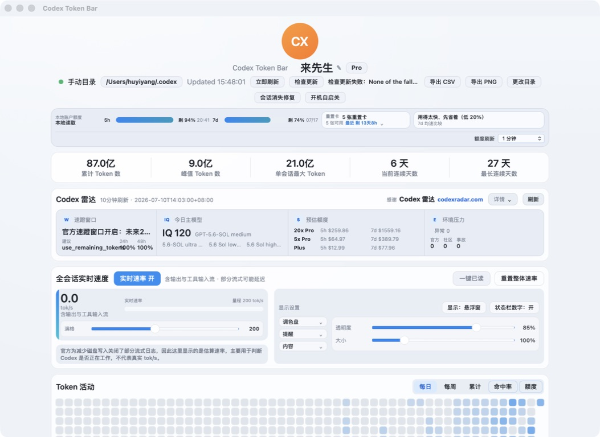
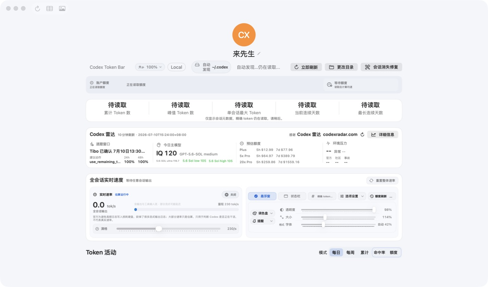
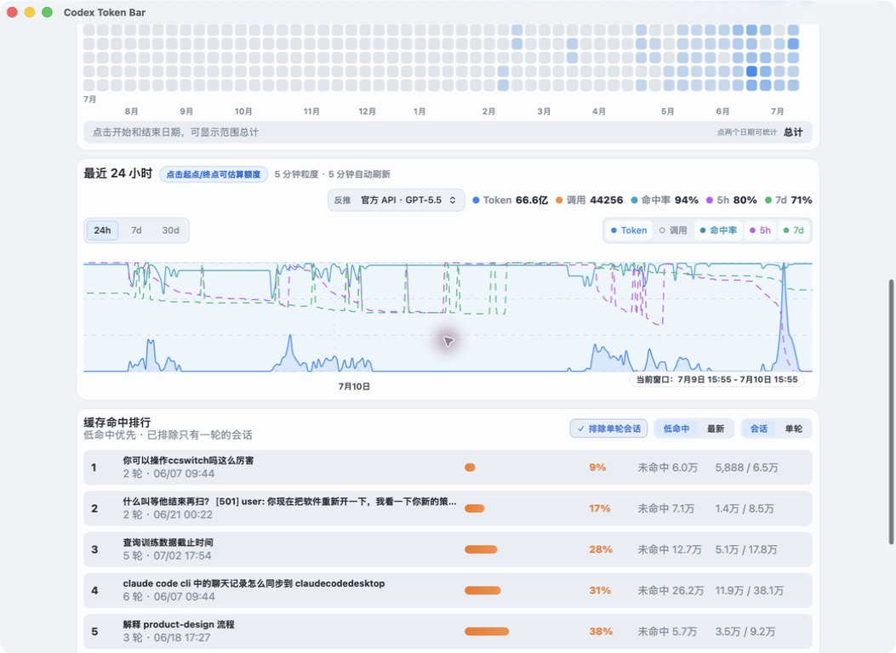
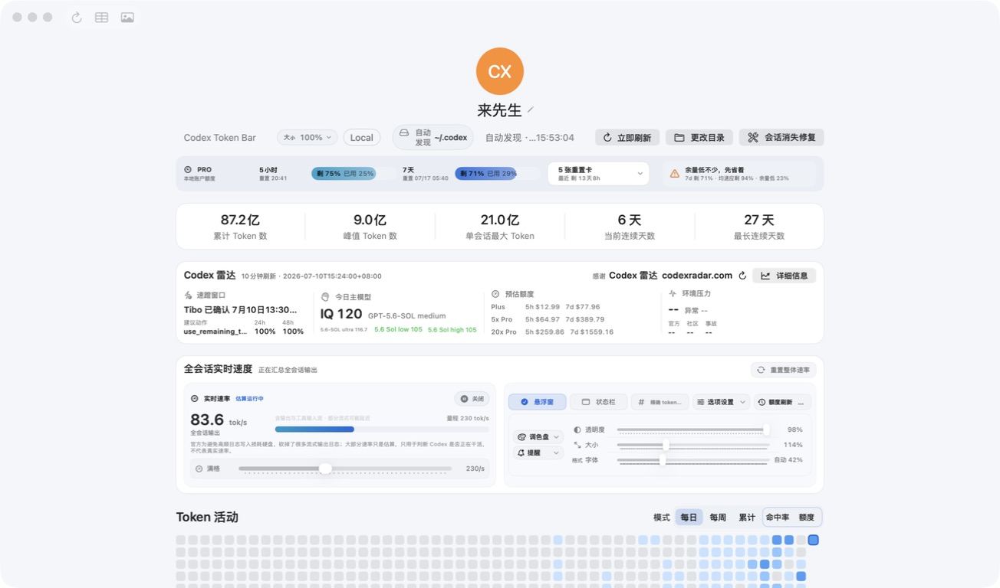

# v0.7.2 UI Audit

Status: in progress

Capture date: 2026-07-10

Surfaces captured from the currently running Swift and Tauri debug applications. The screenshots were saved and inspected before being accepted.

## Step 1 - Tauri dashboard loaded

Health: needs attention.

- Core quota, total, Radar, live-rate, and activity sections are visible without a loading overlay.
- The updater exposes the raw plugin/platform error in the main source/action row: `None of the fallback platforms ...`. The long technical message competes with seven commands, is visibly truncated, and makes the header hard to scan.
- The quota cadence control now has a stable full-width row and remains readable.
- The always-visible unread-baseline button has a clear inactive state and accessible help text.

## Step 2 - Swift cold-start fallback

Health: mixed.

- The metadata-only fallback is honest: all precision-dependent metrics show `待读取` rather than fabricated numbers.
- On this run the fallback was captured at 15:53:02 and the precise snapshot reports 15:53:04, so the cold-start transition completed in roughly two seconds. This capture does not support a performance defect.
- The main dashboard does not expose the unread-baseline command when there are no unread sessions, unlike the Tauri surface.

## Step 3 - Tauri activity chart and cache-hit ranking

Health: generally usable, with accessibility risk.

- The 24-hour chart has a stable height, range label, legend, date context, and the cache-hit ranking uses visible rate tones.
- Tooltip hover and horizontal drag could not yet be fully verified with the capture tool.
- The accessibility tree exposes each daily heat-map cell as a separate toggle. A one-year view therefore creates hundreds of controls before the chart and ranking, making keyboard and screen-reader traversal unnecessarily expensive.

## Step 4 - Swift dashboard after precise load

Health: usable.

- Precise totals and quota eventually replace the startup placeholders without relaunching the app.
- The dashboard keeps a fixed-height hierarchy during the transition, so the loading copy does not insert a new row.
- Swift and Tauri totals were captured at different times while live output was active; the small visible difference is not evidence of a calculation divergence by itself.
- The Computer Use snapshot omitted the Swift activity-mode button descriptions, but source inspection confirms distinct `Token 活动模式 <mode>` accessibility labels. Keep a real VoiceOver pass as the final runtime check rather than treating this as a confirmed code defect.

## Highest-impact UI fixes

1. Move updater success/failure into a stable, bounded status area and translate plugin failures into product copy. Never render raw updater internals in the top command row.
2. Reduce the daily heat-map accessibility surface: one grouped chart/summary plus focused point details is preferable to hundreds of tabbable toggles.
3. Align the unread-baseline command policy across Swift and Tauri.
4. Keep the Swift cold-start fallback bounded to the initial precise scan and preserve the fixed-height transition.

## Evidence limits

- Screenshots and accessibility snapshots do not prove full WCAG compliance.
- Pointer hover, horizontal chart drag, Windows rendering, status-panel interaction, and floating-window focus behavior still need dedicated passes.
- Dynamic total/quota differences were not compared from synchronized source fixtures in this UI pass.
